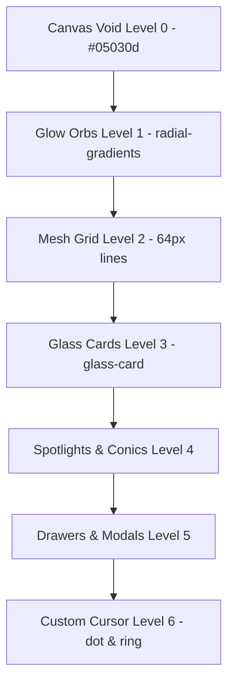

# Overview

The design philosophy of Synsite is built on the concept of **"Engineered Digital Identity."** Rather than treating the interface as a passive document, Synsite structures its visual space to feel like an interactive, living control deck. It targets professional tech-centric users, developers, and premium product owners.

The interface balances two opposite visual forces:
1. **Mathematical Structure**: Standardized layouts, crisp borders, hairline grids (`{colors.glass_border}`), monospace badges, and bold geometric display typography (`{typography.font_display}`).
2. **Organic Physics**: Dynamic particle bursts on click, cursor trails with elastic lag, moving light spots that follow mouse coordinates, and custom WebGL-style glowing orbs that drift and shift dynamically behind the layout.

The visual system is designed to convey absolute technical authority and high-end styling. It does this by rejecting standard flat colors in favor of complex gradients, glassmorphism layers, and continuous motion loops.

---

# Colors

Synsite uses a color palette named **"Cosmic Deep Tech"**, which replaces cold generic greys with deep violet/black backdrops and uses high-impact cyan and magenta accents to draw attention to interactive zones.

### Core Canvas Palette
- **Canvas Void (`{colors.bg_primary}`)**: `#05030d` - A dark indigo-tinted black that establishes the visual base. It absorbs light and provides a high contrast for the neon accents.
- **Surface Elevation (`{colors.bg_secondary}`)**: `#0a061a` - A slightly lighter, rich purple-black used to separate structural sections (e.g. why-us section, scrollbars) from the background.

### Tech Highlights & Accents
- **Core Purple (`{colors.purple_base}`)**: `#7c3aed` - The main brand identifier. Used for core button fills, success state rings, and gradient structures.
- **Highlight Purple (`{colors.purple_bright}`)**: `#8b5cf6` - A bright purple that draws attention. Used as the main color of the custom cursor ring.
- **Light Purple (`{colors.purple_light}`)**: `#a78bfa` - A pastel purple used for gradient text starts and active status text.
- **Core Cyan (`{colors.cyan_base}`)**: `#22d3ee` - Represents electrical energy and micro-actions. It is used as the color of the custom cursor dot, typewriter terminal strings, and progress indicators.
- **Vibrant Pink (`{colors.pink_base}`)**: `#e879f9` - Used in the text gradients to provide a warm, premium finish.

### Transparency & Glass Layers
- **Glass Overlay (`{colors.glass_bg}`)**: `rgba(255, 255, 255, 0.04)` - Extremely translucent white backing.
- **Glass Bounding Divider (`{colors.glass_border}`)**: `rgba(255, 255, 255, 0.09)` - Extremely fine white lines that define card borders and division layouts.
- **Glass Dark Overlay (`{colors.glass_bg_dark}`)**: `rgba(8, 4, 20, 0.75)` - Used for panels that overlap other sections (e.g., the browser mockups and chatbot container) to block out background noise while maintaining transparency.

### Color Psychology
Contrast is used to manage cognitive load. Body content is styled in `{colors.text_secondary}` to rest the eye, while headlines, labels, and badges are styled in high-impact white and neon gradients, allowing users to scan key points.

---

# Typography

Synsite uses typography to create contrast between clean, geometric technical structures and friendly, readable text blocks.

### Display Typeface (`{typography.font_display}`)
- **Font**: `'Outfit', sans-serif`
- **Weights Used**: `{typography.weight_bold}` (700), `{typography.weight_extrabold}` (800), `{typography.weight_black}` (900)
- **Role**: All headers (`h1`, `h2`, `h3`), navigation logo, card numbers, numerical counters, and key CTAs.
- **Aesthetic**: Tight letter-spacing (`-0.03em` to `-0.05em`) and heavy ink-traps that give the site a bold, technical editorial look.

### Body Typeface (`{typography.font_body}`)
- **Font**: `'Inter', sans-serif`
- **Weights Used**: `{typography.weight_light}` (300), `{typography.weight_regular}` (400), `{typography.weight_medium}` (500), `{typography.weight_semibold}` (600)
- **Role**: Paragraph copy, user inputs, form labels, tooltips, and secondary messages.
- **Aesthetic**: Standard spacing with a tall line-height (`1.75` for paragraph bodies) to ensure readability against dark backgrounds.

### Typography Scale
- **Hero Title**: `clamp(2.8rem, 5.5vw, 5rem)` - Dominates the first screen to make a strong impact.
- **Section Headers**: `clamp(2rem, 3.5vw, 3.2rem)` - Sized to anchor each section.
- **Card Subheaders**: `1.2rem` to `1.45rem` - Large and readable titles inside card containers.
- **Monospace details**: Form labels, hints, and badges use small text sizes (`0.75rem` to `0.85rem`) with high letter-spacing (`0.12em`) to mimic code editors.

---

# Layout

The layout uses a structured horizontal grid system that adapts dynamically to different viewport sizes.

```
+------------------------------------------------------------+
|                       Max-Width: 1200px                     |
|  +------------------------------------------------------+  |
|  |                Container Pad: 2rem                   |  |
|  |  +------------------------------------------------+  |  |
|  |  |              Content Columns                   |  |  |
|  |  +------------------------------------------------+  |  |
|  +------------------------------------------------------+  |
+------------------------------------------------------------+
```

### Layout Rules
- **Container Sizing**: Standard containers are centered using `margin-inline: auto`, restricted to a maximum width of `{spacing.container_max}` (`1200px`), and have padding of `{spacing.container_pad}` (`2rem`).
- **Section Margins**: Sections are separated by a vertical padding of `{spacing.section_v_pad}` (`8rem`), giving each conceptual module breathing room.
- **Background Layering**:
  - A fixed background panel (`.bg`) is pinned behind all pages (`z-index: 0`).
  - It contains a repeating 64px structural mesh grid (`.bg__grid`) with a radial masking filter that fades out at the viewport corners.
  - Three large blurred radial gradient orbs (`bg__orb`) drift slowly in the background, keeping the layout visually interesting.

---

# Elevation & Depth

Synsite creates depth using translucent layers, blurred glass backdrops, and interactive animations rather than dark dropshadows.



### Layer Rules
- **Layer 0 (Background)**: `{colors.bg_primary}` - deep black-purple.
- **Layer 1 (Atmosphere)**: Radial glow orbs and the horizontal aurora line.
- **Layer 2 (Grid Structure)**: Bounded mesh lines.
- **Layer 3 (Glass cards & panels)**: Background `{colors.glass_bg}`, blur filter `{spacing.gap}` (28px), and fine border `{colors.glass_border}`.
- **Layer 4 (Interactive Spotlights)**: Conic borders, cursor dot glows, and radial spotlight highlights.
- **Layer 5 (Overlays & Drawers)**: Backdrop filter `blur(40px)` combined with darker glass backgrounds (`{colors.glass_bg_dark}`) to isolate content.
- **Layer 6 (Pointers)**: Custom cursor layers (`#cursor-dot` at `9998` and `#cursor-ring` at `9997`) that sit on top of all interactions.

---

# Shapes

Synsite uses rounded geometry to create a modern, high-tech interface.

- **Small Rounded Elements (`{rounded.sm}`)**: `10px` radius. Used for inputs, selection chips, small buttons, and window navigation bars.
- **Medium Rounded Elements (`{rounded.md}`)**: `14px` radius. Used for step checklists, pricing card sub-groups, and internal boxes.
- **Large Rounded Elements (`{rounded.lg}`)**: `20px` radius. Used for statistics badges, trust bars, and feature lists.
- **Extra Large Shapes (`{rounded.xl}`)**: `28px` radius. Used for main service cards, process cards, and testimonials.
- **Monolithic Container Curves (`{rounded.xxl}`)**: `40px` radius. Used for high-impact form cards and pricing wrappers.
- **Pills (`{rounded.pill}`)**: `100px` radius. Used for primary call-to-action buttons and top navigation badges.

---

# Components

## Navigation

The navigation bar functions as a persistent floating panel that handles layout changes smoothly.

### Desktop Navigation Structure
- **Container**: Floating header at `z-index: 100` that transitions on scroll.
- **Logo**: Positioned on the left, using an SVG image that scales up (`scale(1.04)`) and gains a purple shadow glow (`drop-shadow(0 0 10px rgba(139,92,246,0.55))`) on hover.
- **Menu Links**: Centered horizontally. Links have a bottom margin highlight (`::after`) that expands from `0%` to `100%` on hover using `{transitions.ease}`.
- **Action Targets**: Double buttons placed on the right—a ghost button for "Free Demo" and an outline glow button for "Pricing".
- **Scrolling Behavior**: When scrolled down (`scrollY > 50`), JavaScript adds the `.scrolled` class, which shrinks height (`padding: 0.75rem`), adds a dark background overlay (`rgba(5, 3, 13, 0.88)`), increases blur to `32px`, and adds a subtle bottom border (`rgba(167,139,250,0.1)`).

### Mobile Navigation Drawer
- **Hamburger Button**: Displays three bars that morph into an `X` on click (hiding the middle line, while rotating the outer bars by `45deg` and `-45deg`).
- **Slide-in Overlay**: A full-screen overlay styled with `rgba(5, 3, 13, 0.97)` background and `40px` blur. Displays menu links in a vertical stack, staggered by `0.05s` delay steps.

---

## Cards & Containers

Synsite cards are designed to structure information clearly while providing interactive hover states.

```
+------------------------------------------------------+
|  (Card Outer Edge - Glows on hover)                  |
|  +------------------------------------------------+  |
|  |  Icon Wrapper (Emoji / SVG)                    |  |
|  |  01 (Large background numeral)                 |  |
|  |                                                |  |
|  |  ### Title Header                              |  |
|  |  Paragraph describing the service detail       |  |
|  |                                                |  |
|  |  [ → Arrow indicator appears on hover ]        |  |
|  +------------------------------------------------+  |
+------------------------------------------------------+
```

### Visual Structure
- **Base Style**: Uses `{colors.glass_bg}` backing, `{colors.glass_border}` border, and `{rounded.xl}` border-radius.
- **Card Shimmer**: A diagonal gradient sweep (`skewX(-20deg)`) runs across the card from left to right on hover.
- **Interactive Spotlights**: Placed on card bodies. Using JavaScript variables (`--mx`, `--my`), cards render a spotlight glow when the mouse moves over them.
- **Tilt Physics**: Hovering over cards triggers a 3D tilt effect (`rotateX` and `rotateY` angles shift by up to 8 degrees based on cursor position). Bounding borders highlight to `{colors.purple_bright}` and cards translate up (`translateY(-10px)`).

---

## Inputs & Forms

Forms use structural grouping and clear focus states to guide users.

- **Form Fields (`.fld`)**: Stacked vertically with a gap of `0.4rem` between labels and inputs.
- **Labels**: Small uppercase labels (`0.82rem`) with high letter-spacing (`0.02em`), changing color to `{colors.purple_light}` when focusing on the input below.
- **Input Fields**: Input boxes use rounded shapes (`{rounded.md}` or `{rounded.sm}`), transparent dark fills (`rgba(255,255,255,0.05)`), and thin borders (`rgba(255,255,255,0.1)`).
- **Focus States**: Focused inputs animate their border color to `{colors.purple_base}`, add a subtle purple glow, and gain a soft background tint (`rgba(139,92,246,0.06)`).
- **Input Errors**: Validation failures trigger a red border highlight (`#f87171`) and a red box-shadow glow.

---

## Buttons

Buttons are styled based on their importance, using color and animations to highlight key actions.

### 1. Primary Button (`.btn--primary`)
- **Visuals**: Styled with a gradient fill (`{colors.purple_base}` to `{colors.cyan_base}`) and a rounded shape (`{rounded.pill}`).
- **Interactive States**:
  - **Magnetic Pull**: Hovering over primary buttons draws them towards the cursor by up to 25% of the offset distance.
  - **Click Particle Burst**: Clicking triggers a particle burst animation, spawning 18 colored dots that scatter in random directions.
  - **Ripple Expand**: Click triggers an expanding ripple element (`ripple-expand` animation) scaling up from the button's center.

### 2. Ghost Button (`.btn--ghost`)
- **Visuals**: Backed by a translucent fill (`rgba(255,255,255,0.04)`), a subtle white border (`rgba(255,255,255,0.12)`), and a `8px` backdrop-filter blur.
- **Interactive States**: Hovering shifts background color to `{colors.purple_base}` at 10% opacity, changes border color to `{colors.purple_light}`, and translates the button up by `2px`.

### 3. Outline Glow Button (`.btn--outline-glow`)
- **Visuals**: Styled with a transparent fill and a thin border (`rgba(167, 139, 250, 0.4)`).
- **Interactive States**: Hovering shifts background color to `{colors.purple_bright}` at 12% opacity, lights the border color to `{colors.purple_light}`, and adds a soft purple glow.

---

## Tags / Badges

Tags and badges are used for quick labels and visual hierarchy.

- **Visual Style**: Capsule pill shapes with a 100px border-radius, translucent purple background (`rgba(139, 92, 246, 0.14)`), and light purple borders (`rgba(167, 139, 250, 0.5)`).
- **Badge Shine**: A continuous shimmer animation (`badge-shine`) runs across badges from left to right.
- **Pulsing Indicator**: Badges contain a small green/cyan dot (`.badge__dot`) that pulses using keyframes (`pulse-dot`), giving the tag an active, live feel.

---

## Modals / Drawers

When overlay panels slide into view, they use blurred glass backdrops to maintain depth.

- **Visual Style**: Dark translucent overlays (`rgba(5, 3, 13, 0.97)`) combined with high blur settings (`backdrop-filter: blur(40px)`).
- **Slide-in Animation**: Drawers slide in from screen edges using `{transitions.ease}` curves. Escaping drawer view is supported via keyboard (`Escape` key press) or background clicks.

---

## Tables / Data UI

Data UI layouts (like invoice summary banners and quote lists) are designed to be clean and legible.

- **Visual Structure**: Horizontal tables are replaced by grid lists separated by hairline borders.
- **Highlights**: Important numerical summaries use text gradients, display typography (`{typography.font_display}`), and larger weights (`{typography.weight_black}`).
- **GST Selection Switcher**: An interactive sliding toggle switcher. Uses a track of size `44px x 24px` and a circular dot of size `18px x 18px` that slides left or right based on selection.

---

# Dashboard Patterns

The Client welcome board displays user data using simple, dark surfaces.

- **Client Welcome Banner**: Placed at the top of portal panels, styled with a light purple background (`rgba(139, 92, 246, 0.07)`) and a bottom border divider.
- **Layout Organization**: Portal cards use grid grids (`grid-template-columns: 1fr 1.1fr`) to separate invoice listings from card details.
- **Avatars**: Initial icons use display typography and are backed by purple-to-cyan gradients.

---

# Hero Sections

Synsite uses three distinct hero styles, tailored to the purpose of each page:

### 1. Agency Landing Hero (Typographic Terminal Grid)
- **Background**: Uses a tech grid backdrop combined with radial gradient masks.
- **Typewriter Effect**: The primary title features a typewriter animation (`typewriter-cursor`), writing out the heading text letter-by-letter.
- **Visuals**: A balanced browser mockup is placed on the right, accompanied by floating gradient circles (`.stat-chip`) that drift slowly via keyframe animations (`float-a`, `float-b`).

### 2. Payment Portal Hero (Vocal Split columns)
- **Visual Style**: Simple grid columns separating invoice data from card details.
- **Aesthetic**: Low-profile layout elements that focus user attention on forms.

### 3. Quote Wizard Hero (Progressive Tracker Header)
- **Visual Style**: A central progress tracker (`.steps-bar`) that visualizes the multi-step request form.
- **Progress Line**: Active states animate a progress line from left to right (`scaleX(0)` to `scaleX(1)`) as steps are completed.

---

# CTA Philosophy

Synsite's call-to-actions are direct, focused, and designed to look premium.

- **Primary Actions**: Highlighted using primary buttons with gradient fills, magnetic pull animations, and particle effects.
- **Secondary Actions**: Styled as ghost buttons that transition to soft purple fills on hover, keeping the main focus on the primary action.

---

# Imagery & Illustration Style

The visual assets combine geometric forms, photography, and functional mockups.

- **Mockups**: Styled as browser windows with custom header dots (red, yellow, green) and URL input highlights.
- **Stat Chips**: Floating chips that drift around mockups using CSS animations, displaying key metrics with emojis and display typography.

---

# Motion & Animation

Animations are built with CSS keyframes and JavaScript listeners to make the page feel responsive.

### 1. Custom Cursor Lag
- **Dot Tracker**: Pins `#cursor-dot` to the mouse coordinates instantly.
- **Ring Tracker**: Puts `#cursor-ring` on a delayed path, smoothing movement using a linear interpolation step (`rx += (mx - rx) * 0.12`).
- **Interactive Hover Scale**: Hovering over buttons scales the ring from `36px` to `56px` and shifts its border color to cyan.

### 2. Interactive Spotlight
- **Card Spotlights**: Cards use CSS variables (`--mx`, `--my`) to render a radial gradient spotlight that follows the cursor on hover.
- **Conic Border Spin**: Metric cards feature a rotating conic border highlight (`conic-gradient`) that spins continuously on hover.

### 3. Micro-Animations & Easing
- **Magnetic Buttons**: Follows the mouse offset by `25%` and uses an elastic bounce-back transition on leave.
- **Particle Burst**: Click triggers a burst of 18 colored dots that scatter outwards.

---

# Responsive Behavior

Layouts adapt fluidly across devices, maintaining clear structures on all screens.

- **Breakpoints**:
  - `Desktop Large`: `{spacing.container_max}` (`1200px`)
  - `Tablet`: `900px` (hides main menu links, displays hamburger button)
  - `Mobile Medium`: `768px` (collapses grid columns into single vertical stacks, centers text alignments, and hides floating stat chips)
  - `Mobile Small`: `480px` (reduces card padding to maximize space)

---

# State Variants

Interactive elements feature clear, matching hover and focus states.

- **Nav Links**: Shift color to white and expand a gradient underline to 100% width on hover.
- **Card Hovers**: Scale up slightly (`scale(1.02)`), slide up (`translateY(-10px)`), and gain a subtle cream-tinted drop-shadow. Bounding border gradient highlights to a brighter tone.
- **Button Active State**: Tapping buttons triggers a slight shrink to simulate physical feedback:
  ```css
  .btn:active {
      transform: translateY(-1px) scale(1);
  }
  ```

---

# Design Principles

Four core guidelines shape the Synsite user experience:

1. **Vibrant Technical Atmosphere**: Use deep cosmic canvases, glassmorphic floating panels, and sleek cyan and purple light trails.
2. **Design with Intent**: Avoid decorative elements that don't serve a purpose. Hairlines, numbers, and grids must help organize information.
3. **Reward Curiosity**: Implement physical properties like magnetic buttons and responsive cursor trails.
4. **Control Contrast**: Keep body copy soft and headings prominent.

---

# Do’s and Don’ts

### Do
- Use dark indigo-tinted black (`#05030d`) for the primary background void.
- Use Outfit for headings and Inter for body text.
- Apply glassmorphism styling to cards using `{colors.glass_bg}` and `{colors.glass_border}`.
- Use cyan (`#22d3ee`) for technical highlights.

### Don't
- Use pure digital black (`#000000`) for the primary canvas background.
- Use generic blue, green, or red colors for buttons or borders.
- Keep cursor trail lag animations active if they cause performance lag.
- Overcomplicate forms; keep layouts simple and direct.

---

# Iteration Guide

To replicate this design style on a new project, follow these steps:

1. **Set Up the Base CSS**: Define the Cosmic Deep Tech color tokens, fonts (Outfit and Inter), and spacing utilities.
2. **Style with Hairlines**: Build cards using glassmorphism styling and fine white borders.
3. **Implement Typographic Hierarchy**: Alternate bold geometric titles with readable sans-serif body copy.
4. **Add Micro-interactions**: Integrate magnetic movement on buttons and add word-reveal animations on scroll.
5. **Polishing Details**: Add decorative elements like light background watermarks, custom cursor trails, and a vertical stretch text section.

---

# Known Gaps

The following details were not defined in the source files and should be chosen based on project needs:

- **Input Error States**: How validation errors are styled. *Recommendation*: Use a soft red underline (`rgba(255, 100, 100, 0.5)`) and small error text, keeping inline with the minimal theme.
- **Dark/Light Mode Toggle**: The site is designed as a dark theme. If a light mode is needed, invert the colors (cream background, dark gray text, and dark line borders).
- **Secondary Pages**: Only landing, coming-soon, and product pages are defined. Multi-page navigation should maintain the fixed blurred header and clean layouts.
- **Complex Data Display**: Multi-column tables are not implemented. *Recommendation*: Use simple grid layouts separated by horizontal hairlines.
